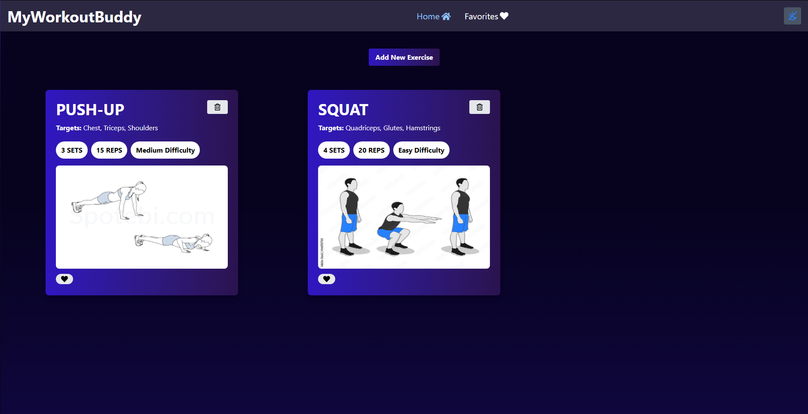
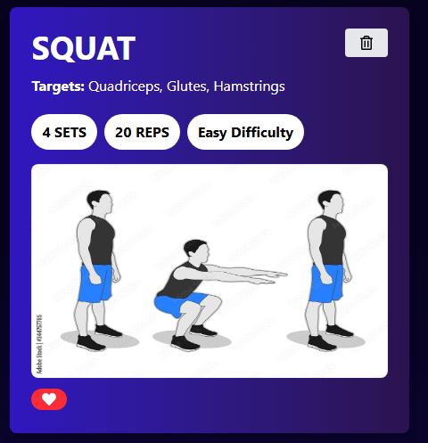
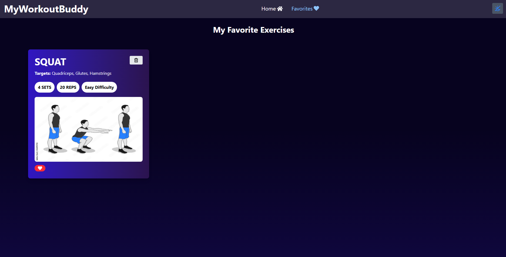
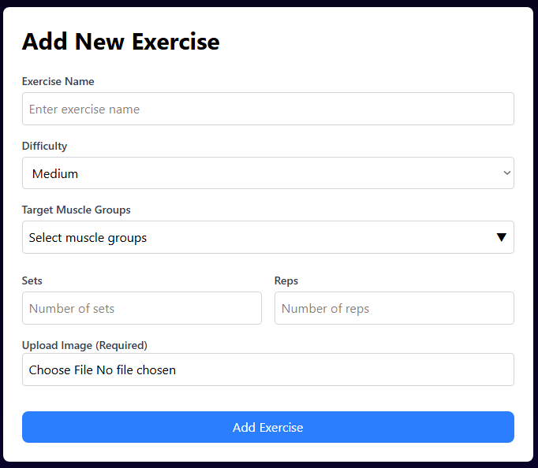

# Lab 6 - Front-end

by Revenco Victor - FAF-221

## Project Overview
This laboratory is about creating a client-side only web app on the topic of gym exercises.

## Client requirements
- **Entities that can be manipulated** - we have exercises that can be liked and viewed in a favorites list, exercises that can be removed, and also the feature of adding a new 
desired exercise
- **Custom theme** - the app uses gradients that make the app appealing and also features a light/dark mode
- **Deployment** - the app is deployed using Vercel

## Technologies Used
- **React** as a web library
- **Git & GitHub** for version control
- **Tailwindcss** for styling
- **Vite** for building the app and optimizing the build

We have some items stored in local storage such as exercises, theme, favorite exercises.

## Screenshots

